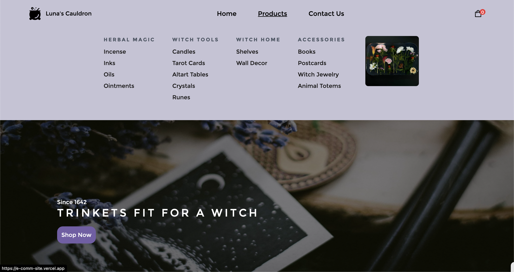

## Table of contents

- [Overview](#overview)
  - [Screenshot](#screenshot)
  - [Links](#links)
- [My process](#my-process)
  - [Built with](#built-with)
  - [What I learned](#what-i-learned)
  - [Continued development](#continued-development)
- [Acknowledgments](#acknowledgments)

## Overview

### Screenshot



### Links

- Live Site URL: [Demo](https://lunas-cauldron.vercel.app/)

## My process

Starting off, I loosely followed a tutorial on Sanity by Javascript Mastery on Youtube which helped me through the initial sanity Schema building. I learned that Sanity's Content Lake can be a powerful headless CMS that I can then connect to my app by using GROQ and GraphQL queries.

After fetching data from Sanity, I then pass the data down to the different components that need it like the NavBar, FooterBanner, HeroBanner, ProductBanner, and Product components. The power of NextJs allowed me to retrieve this data from the server meaning that the data loads almost instantaneously.

A lot of my time was spent on ensuring that the site template was fully mobile and tablet responsive. In future iterations of this project, I want to add a dark mode button so that client's have that option if they need it.

### Built with

- Semantic HTML5 markup
- CSS custom properties
- Flexbox
- Mobile-first workflow
- [React](https://reactjs.org/) - JS library
- [Next.js](https://nextjs.org/) - React framework
- [TailwindCSS](https://tailwindcss.com/) - For styles
- [Stripe](https://stripe.com/) - For Payment

### What I learned

I learned that Sanity uses their own interpretation of the GraphQL language called GROQ which is similar but more powerful than standard queries because it allows the developer more control over the data queried.

Also learned that e-commerce applications are relatively simple. It's a main home page with different sections and products, and then a Product Details Page that features the product selected, and lastly there's a checkout page with optional Success notifications. Everything beyond that tends to be needed for analytics, customer service, and business analytical tools.

```js

I wanted to highlight the way GROQ queries work.

export const getServerSideProps = async () => {
  const products = await client.fetch('*[_type == "product"]');
  const heroBanner = await client.fetch('*[_type == "heroBanner"]');
  const footerBanner = await client.fetch('*[_type == "footerBanner"]');
  const navData = await client.fetch('*[_type == "nav"]{title, linkUrl, navTile}');
  const aboutUsBanner = await client.fetch('*[_type == "aboutUsBanner"]');
  const subCategoryData = await client.fetch(`
    *[_type == "nav"] {
      title,
      navItem[] {
        title,
        itemAndLink {
          link[]{
            subCategory,
            navItemUrl
          }
        }
      }
    }
  `);

  return {
    props:{products, heroBanner, navData, subCategoryData, footerBanner, aboutUsBanner}
  }
}

```

### Continued development

I want to possibly integrate Shopify and Shipstation to increase the scalability of this template but both these technologies have a steep monthly premium so it will have to wait.

## Acknowledgments

Thanks to Flowbite for providing a library of responsive and customizable Tailwind solutions and to Javascript Mastery on Youtube for helping me understand Sanity.io.
